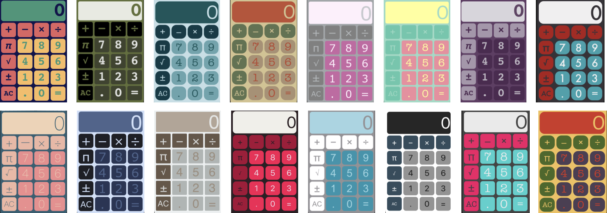

# Calculator

A calculator app with various color schemes. 

**Technical Info:** \
Xcode12 project written in Swift 5 for iOS\
Delegate Pattern, Protocols, Extensions, Enums, User Defaults, Tuples, Outlet Collections, Functions as Parameters, Number Formatter, Hidden Status Bar, Unit Tests, UI Tests, Presenting/Dismissing of view controllers

**See Also:** \
[Quickies - a variety of example iOS apps](https://github.com/PepperoniJoe/Quickies)\
 [Make Icons Swiftly - used to generate app icon sets
 ](https://github.com/PepperoniJoe/Make-Icons-Swiftly)

**Author:** \
Marcy Vernon [@MarcyVernon](https://twitter.com/MarcyVernon)

**License:** \
"Calculator" is under the MIT license. See [LICENSE](/LICENSE) for more information.
